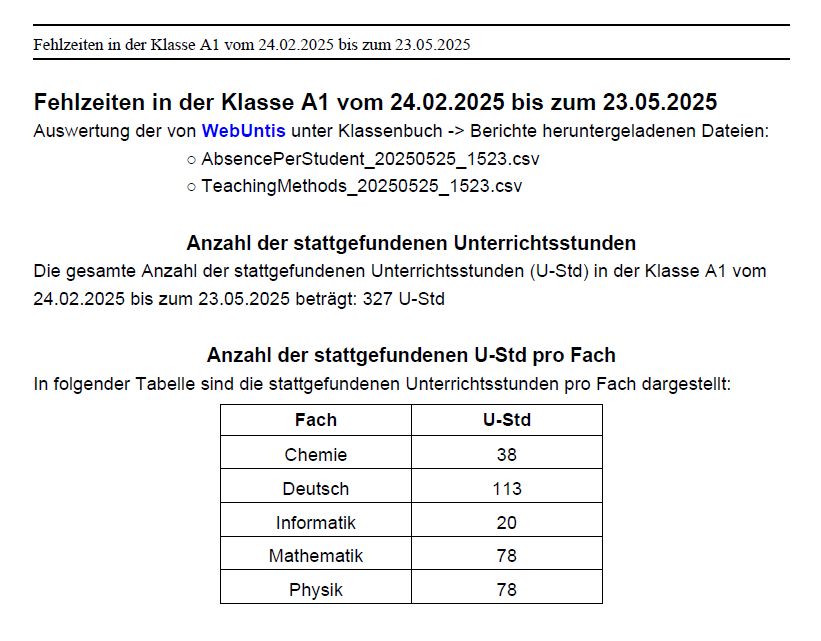
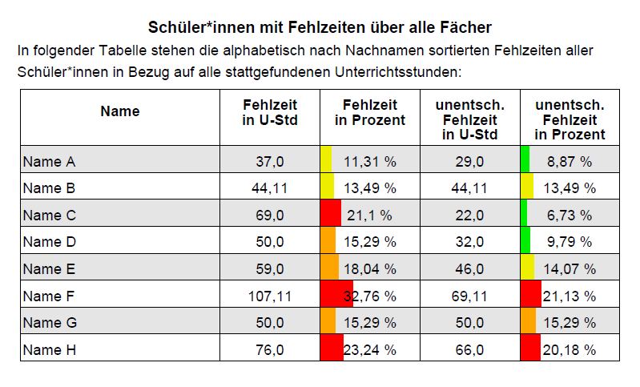
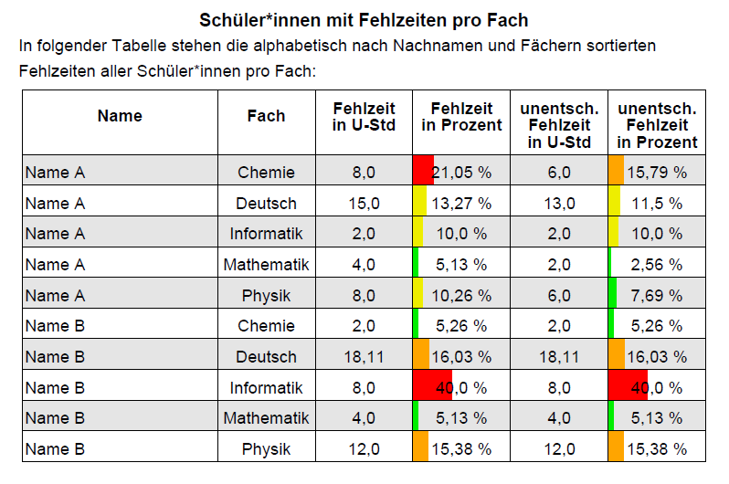
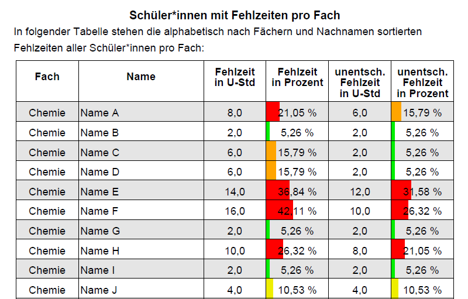

# FEHLZEITEN

## Beschreibung

Das Programm FEHLZEITEN erstellt aus zwei Berichtstabellen von [WebUntis](https://webuntis.com) Übersichtstabellen
zu allen stattgefundenen Unterrichtsstunden und den Fehlzeiten von Schüler:innen. 
Alle Informationen dieser Übersichtstabellen findet man zwar unter den Berichten bei WebUntis,
aber -zumindest bis dato- nicht in dieser zusammengefassten Form, die das Programm FEHLZEITEN erstellt.

Die Tabellen werden durch das Programm wahlweise in einer CSV-Datei oder in einem PDF-Dokument erstellt.

Beispiel-Darstellung von stattgefundenen Unterrichtsstunden in dem erzeugten PDF-Dokument:

In den Fehlzeitentabellen werden die gesamten Fehlzeiten der Schüler:innen und die von diesen unentschuldigten Fehlzeiten
jeweils in Unterrichtsstunden und in Prozent nebeneinander dargestellt. Dabei beziehen sich die Prozentangaben auf die
gesamten stattgefundenen Unterrichtsstunden einer Klasse innerhalb des bei der Erstellung der Berichtstabellen
von WebUntis ausgewählten Zeitbereichs.

In dem PDF-Dokument werden die Tabellenzellen der prozentualen Fehlzeiten zusätzlich mit farbigen Balken unterlegt, 
deren Längen den Prozentwerten entsprechen. Zudem sind die Balken in unterschiedlichen Farben dargestellt: 
Liegen die Fehlzeiten unterhalb von 10 %, werden die Balken grün gefärbt; bei Fehlzeiten ab 10 % und kleiner als 15 %, 
werden die Balken gelb; ab 15 % und kleiner als 20 %, werden sie orange und bei Fehlzeiten ab 20 %, werden die Balken rot gefärbt.

Beispieldarstellungen in dem erzeugten PDF-Dokument:

Weiterhin werden alle Fehlzeiten und die davon unentschuldigten Fehlzeiten pro Fach in der 1. Spalte nach Schüler:innen 
sortiert dargestellt:

und darunter die Fehlzeiten in der 1. Spalte nach Fächern sortiert dargestellt:

Die Prozentangaben bei den Fehlzeiten pro Fach beziehen sich auf die gesamten stattgefundenen Unterrichtsstunden in dem 
jeweiligen Fach einer Klasse.

## Benötigte Tabellen von WebUntis

Zur Bestimmung der Fehlzeiten benötigt das Programm zwei Tabellen von Webunits als CSV-Dateien, die man bei WebUntis 
unter Klassenbuch -> Berichte findet:
Dort oben links unter "Klasse" die Klasse und bei Schüler:innen "Alle" einstellen. Rechts daneben den gewünschten
Zeitraum einstellen.

Darunter jeweils einen Haken bei "Fehlzeiten" und "Verspätungen" setzen.

Bei "Fehlzeiten pro Schüler:in" die Auswahlen "pro Stunde"  und "Alle"  einstellen.

Dann rechts neben "Fehlzeiten pro Schüler:in" auf CSV klicken und oben rechts im sich öffnenden Popup-Fenster auf 

*AbsencePerStudent... 

klicken.

Dann weiter unten, rechts von "Lehrformen", wieder durch Klick auf CSV die CSV-Datei 

*TeachingMethods... 

herunterladen.

Die TeachingMethods-Datei wird benötigt, um die gesamten stattgefundenen Unterrichtsstunden in der Klasse und 
die stattgefundenen Unterrichtsstunden pro Fach zu ermitteln.

## Anleitung zum Programm

Durch Klick auf den Button "Bearbeiten" im Hauptfenster des Programms öffnet sich ein Fenster mit den Entschuldigungsgründen.

In dem Fenster "Entschuldigungsgründe" können dann einige oder alle voreingestellten Gründe gelöscht werden, oder/und 
welche diesen hinzugefügt werden. 

Durch Klick auf den Button „Wähle Ordner“ in dem Hauptfenster des Programms wird der Ordner ausgewählt, in dem sich die 
von WebUntis heruntergeladenen Dateien befinden, und in welchen die Fehlzeitentabellen-Datei geschrieben werden soll. 
Anschließend werden durch Klick auf die Buttons „Datei öffnen…“ jeweils unterhalb von Öffnen von TeachingMethods als 
CSV-Datei und Öffnen von AbsencePerStudent als CSV-Datei die von WebUntis heruntergeladenen Dateien eingelesen. 
Hierbei auf die Reihenfolge achten, also zuerst die TeachingMethods-Datei einlesen und danach die AbsencePerStudent-Datei.

Erstellen der Fehlzeitentabellen als CSV-Datei:
Das Programm erzeugt, wenn die TeachingMethods-Datei und die AbscencePerStudent-Datei erfolgreich eingelesen wurden, 
bei Klick auf den "Erstellen"-Button unterhalb von Erstellen der Fehlzeitentabellen als CSV-Datei die Fehlzeiten-Tabellen 
als CSV-Datei mit dem Semikolon als Feldtrenner in dem ausgewählten Ordner.

Erstellen der Fehlzeitentabellen als PDF-Datei:
Das Programm erzeugt, wenn die TeachingMethods-Datei und die AbscencePerStudent-Datei erfolgreich eingelesen wurden, 
bei Klick auf den "Erstellen"-Button unterhalb von Erstellen der Fehlzeitentabellen als PDF-Datei die Fehlzeiten-Tabellen 
als PDF-Datei in dem ausgewählten Ordner.

## Datenschutz und Sicherheit

Das Programm FEHLZEITEN erfasst keine anderen Daten als die aus den von WebUntis heruntergeladenen AbsencePerStudent- und 
TeachingMethods-Dateien, die eine Benutzerin oder ein Benutzer in das Programm einlesen lässt. 
Das Programm versendet keine Daten nach Außen und speichert auch keine Daten dauerhaft ab, wenn keine Dateien 
zur Programmlaufzeit erzeugt werden. D.h es werden vom Programm nur die Daten dauerhaft gespeichert, die eine Benutzerin 
oder ein Benutzer durch das Programm als Dateien in dem von ihr bzw. ihm ausgewählten Verzeichnis erzeugen lässt. 

## Einlesen der CSV-Fehlzeiten-Tabellen in ein Tabellenkalkulationsprogramm

Die erstellte CSV-Datei kann mit einem Tabellenkalkulationsprogramm, also z.B. Excel oder Libreoffice problemlos 
eingelesen werden, wenn man das Semikolon als Trennoption einstellt. 

Auf Wunsch kann in dem Tabellenkalkulationsprogramm über "Speichern unter" aus dieser CSV-Datei auch eine 
Excel-Datei erzeugt werden.

## Installation
Hier sind fertige Installationspakete für Linux, MacOS und Windows zu finden:
[releases](https://github.com/ReneJursa/fehlzeiten/releases/)

Windows:
Zur Installation auf einem Computer mit einem Windows-Betriebssystem das Programm über die Datei 
Fehlzeiten-1.4.0_win_x64.msi installieren. Falls hierbei die Meldung „Der Computer wurde durch Windows geschützt“ 
auftaucht, dann auf „Weitere Informationen“ klicken und danach auf „Trotzdem ausführen“.

Linux:
Zur Installation auf einem Computer mit einer Linux-Distribution, die Debian-basiert ist, also z.B. Debian, MX Linux,
Linux Mint, Ubuntu und Derivate, das Programm über die Datei fehlzeiten_1.4.0_linux_amd64.deb installieren. 
Bei anderen Linux-Distributionen, auf denen sich RPM-Pakete installieren lassen, wie z.B. Fedora, OpenSUSE oder Red Hat,
das Programm über die Datei fehlzeiten-1.4.0_linux_x86_64.rpm installieren.  

MacOS:
Zur Installation auf einem Computer mit einem MacOS-Betriebssystem das Programm über die Datei fehlzeiten_1.4.0_macOS.dmg 
installieren.

## Weitere Hinweise

Wenn man die Entschuldigungsgründe im Programm verändert hat, muss die AbscencePerStudent-Datei nochmal neu 
eingelesen werden, da beim Einlesen dieser entschieden wird, ob eine Fehlzeit als unentschuldigt zu werten ist. 
Darauf weist das Programm aber auch hin, und es ist sonst auch nicht möglich, die Fehlzeiten-Tabelle neu zu erstellen, 
sondern erst wenn man die AbscencePerStudent-Datei nochmal einliest.

Wenn man im Haupfenster auf den Button "Bearbeiten" klickt, werden immer zunächst die voreingestellten 
Entschuldigungsgründe eingelesen. D.h., wenn man andere als die voreingestellten Gründe zur Fehlzeiten-Bestimmung 
verwenden will, darf man direkt vor dem Öffnen der AbscencePerStudent-Datei nicht nochmal auf den Button "Bearbeiten" klicken.  

Wenn man die TeachingMethods-Datei nochmal neu einliest, wird aus Sicherheitsgründen vom Programm nochmal ein Einlesen 
der AbscencePerStudent-Datei verlangt.

Unterrichtsstunden, die zwar im Stundenplan stehen, aber ausgefallen sind, werden bei der Berechnung der gesamten 
Fehlzeiten nicht berücksichtigt. Diese werden bei WebUntis als "Storniert" angegeben. 

Um die unentschuldigten Fehlzeiten zu bestimmen, werden vom Programm voreingestellt der Status und die weiteren 
von WebUntis verwendeten Standard-Begriffe "Krankheit" und "Verspätet"
sowie weitere individuelle Begriffe als Entschuldigungsgründe genutzt, die man unter Text bei WebUntis frei eintragen kann.

Das Programm verwendet die voreingestellten Entschuldigungsgründe: 
entsch.
AUB
Attest
Krankheit
Entschuldigt
Behörde

"entsch." ist der Begriff des Status bei WebUntis, wenn man die Abwesenheit einer Schüler:in auf entschuldigt setzt. 
Dieser Status ist in der Spalte "Status" der AbsencePerStudent - Tabelle gesetzt.

Das Programm kann auch noch alle Begriffe, die man bei WebUntis unter Text als Gründe zur Entschuldigung eingegeben hat, 
verwenden, um eine entschuldigte Fehlzeit auch als solche zu erkennen. 

Die voreingestellten Begriffe können im Programm durch beliebige andere Begriffe erweitert oder ersetzt werden, die man 
bei WebUntis als Entschuldigungsgründe eingetragen hat. Diese Begriffe müssen dann allerdings dem Programm genau so 
mitgeteilt werden, nur zwischen Groß- und Kleinschreibung unterscheidet das Programm nicht.  

Die Begriffe, die man unter Text in der UntisApp eingetragen hat, stehen in weiteren der Spalten der 
AbsencePerStudent - Tabelle. Konkret wertet das Programm dafür neben dem Eintrag unter der Spalte "Status" die Einträge 
unter den Spalten "Abwesenheitsgrund", "Text" und  "Entschuldigungstext" aus. Sobald das Programm in einer der dafür 
vorgesehenen Spalten der AbsencePerStudent - Tabelle einen der Begriffe zur Entschuldigung findet, gilt die 
betreffende Fehlzeit als entschuldigt, also auch unabhängig davon, ob der Status der Fehlzeit von WebUntis auf "entsch." 
oder "offen" gesetzt ist.  

Mögliche Warnungen und Fehlermeldungen:
Wenn in der AbsencePerStudent-Datei in einer Zeile kein Fach aufgeführt ist, dann wird eine Warnung ausgegeben mit der 
Zeilennummer, in der das Fach fehlt. 
Bei Klick auf "OK" wird das fehlende Fach durch "unbekannt" ersetzt und zur nächsten Zeile gegangen. Die Fehlzeiten 
des Faches "unbekannt" werden dann so auch in den erstellten Fehlzeitentabellen übernommen. 
Wenn man das nicht will und das wahre Fach kennt, müsste man in der AbsencePerStudent-Datei in der entsprechenden 
Zeile das Fach händisch einfügen. 

Wenn in der AbsencePerStudent-Datei eine Zeile aufgeführt ist, bei der eine Schüler:in nicht oder nicht mehr in 
der Klasse der eingelesenen TeachingMethods-Datei ist, dann wird eine Warnmeldung ausgegeben. 
Bei Klick auf "OK" wird zur nächsten Zeile gegangen. 
Die dargestellten Fehlzeiten dieser anderen Klasse werden nicht in den Fehlzeitentabellen dargestellt.   

Wenn ein Fach in der  AbsencePerStudent-Datei einer Klasse steht, das nicht in der TeachingMethods-Datei dieser 
Klasse aufgeführt ist,  dann wird eine Fehlermeldung ausgegeben. Bei Klick auf "OK" wird zur nächsten Zeile gegangen.
Die zugehörige Fehlzeit wird nicht in den Fehlzeitentabellen dargestellt. 

## Lizenz

Das Programm FEHLZEITEN wird unter der GNU General Public License veröffentlicht.

Copyright (C) 2026 René Jursa

## Third Party Produkte

FEHLZEITEN enthält folgende Third Party Software:

* JavaFX (Open source Java client application platform): https://openjfx.io/

* OpenPDF (Open source Java library): https://github.com/LibrePDF/OpenPDF/ 